# Sonar

A personal job-search system: find roles that fit, tailor an honest resume for
each one, fill application forms with less friction, and keep a record of what
happened.

This is a sanitized snapshot of a private working repo. The code is complete;
all personal data (profile, resumes, application history, scan results) has
been removed and replaced with fictional examples or empty templates.

## Watch the tour

[](docs/media/sonar-explained.mp4)

84 seconds, from the morning scan to the filled form. Click the image to play it.

## The parts

```
apps/scanner/       daily job scanner → Telegram + Google Sheets  (ESM Node, no build)
apps/web/           Next.js 14 app: resume editor, tailoring, tracker, analytics
apps/extension/     "Bekar Apply": MV3 Chrome extension, ATS form autofill
apps/bridge/        local-only Node server connecting the extension to these files
packages/profile/   resume source of truth + the rules that govern tailoring
```

There is no root `package.json`. Dependencies are installed per app:
`npm install` inside whichever app you're working on. `CLAUDE.md` has the full
technical brief (architecture, known issues, exact commands), written for an
AI coding agent working in this repo.

## Architecture

```mermaid
flowchart TD

subgraph group_discovery["Job discovery"]
  node_scanner["Job scanner<br/>[scan.mjs]"]
  node_scanledger[("Scan ledger")]
end

subgraph group_profile["Profile source"]
  node_master["Verified master profile<br/>[master-profile.ts]"]
  node_profileexport["Extension profile export"]
end

subgraph group_web["Resume web app"]
  node_webui["Resume editor and tracker<br/>[page.tsx]"]
  node_webapi["Tailor and resume APIs<br/>[route.ts]"]
  node_webstore[("Resume and application storage<br/>[index.ts]")]
  node_analytics["Application analytics<br/>[route.ts]"]
end

subgraph group_extension["Apply extension"]
  node_atsform["ATS form detection and fill<br/>[content.ts]"]
  node_profiledata[("Stored extension profile<br/>[profile.ts]")]
  node_autofill["Field classification and autofill"]
  node_graphservice["Graph memory service<br/>[service.ts]"]
  node_graphstorage[("Graph memory storage<br/>[storage.ts]")]
  node_extensionai["Local AI and resume tools<br/>[ai-provider.ts]"]
end

subgraph group_integration["Local integration"]
  node_bridge["Token-authenticated local bridge<br/>[server.mjs]"]
  node_apptracker[("Markdown application tracker")]
end

node_seeker(("Job seeker"))
node_ats{{"ATS portals"}}
node_sheets[("Google Sheets")]
node_telegram{{"Telegram digest and bot"}}
node_ollama{{"Ollama"}}
node_gemini{{"Gemini or Claude"}}

node_seeker -->|"requests role scan"| node_scanner
node_scanner -->|"queries job APIs"| node_ats
node_scanner -->|"deduplicates results"| node_scanledger
node_scanner -->|"pushes job rows"| node_sheets
node_scanner -->|"sends digest"| node_telegram
node_master -->|"provides profile facts"| node_profileexport
node_seeker -->|"edits and tailors resume"| node_webui
node_webui -->|"requests tailoring"| node_webapi
node_webapi -.->|"stores resume data"| node_webstore
node_webui -.->|"views outcomes"| node_analytics
node_profileexport -->|"exports extension profile"| node_profiledata
node_seeker -->|"visits application form"| node_atsform
node_atsform -.->|"classifies form fields"| node_autofill
node_profiledata -.->|"supplies answers"| node_autofill
node_atsform -.->|"delegates memory requests"| node_graphservice
node_graphservice -->|"loads and saves graph"| node_graphstorage
node_atsform -->|"offers writing tools"| node_extensionai
node_extensionai -->|"uses by default"| node_ollama
node_extensionai -.->|"supports opt-in providers"| node_gemini
node_atsform -->|"pushes tracked applications"| node_bridge
node_bridge -->|"appends applications"| node_apptracker


classDef toneNeutral fill:#f8fafc,stroke:#334155,stroke-width:1.5px,color:#0f172a
classDef toneBlue fill:#dbeafe,stroke:#2563eb,stroke-width:1.5px,color:#172554
classDef toneAmber fill:#fef3c7,stroke:#d97706,stroke-width:1.5px,color:#78350f
classDef toneMint fill:#dcfce7,stroke:#16a34a,stroke-width:1.5px,color:#14532d
classDef toneRose fill:#ffe4e6,stroke:#e11d48,stroke-width:1.5px,color:#881337
classDef toneIndigo fill:#e0e7ff,stroke:#4f46e5,stroke-width:1.5px,color:#312e81
classDef toneTeal fill:#ccfbf1,stroke:#0f766e,stroke-width:1.5px,color:#134e4a
class node_scanner,node_scanledger toneBlue
class node_master,node_profileexport,node_sheets toneAmber
class node_webui,node_webapi,node_webstore,node_analytics toneMint
class node_atsform,node_profiledata,node_autofill,node_graphservice,node_graphstorage,node_extensionai toneRose
class node_bridge,node_apptracker,node_seeker,node_ats,node_telegram,node_ollama,node_gemini toneIndigo
```



## How it fits together

```
portals.yml ──► scanner ──► data/*.tsv, pipeline.md ──► Google Sheet
                   │                                  └► Telegram digest + bot
                   ▼
master-profile.json ──► selectProfile() ──► web app (tailored resumes)
                                     └────► extension-profile.json ──► Chrome extension
                                                                        │
                        data/applications.md ◄── bridge ◄───────────────┘
```

**Scanner (`apps/scanner`).** Hits applicant-tracking-system APIs directly
(Greenhouse, Ashby, and Lever, auto-detected per company from its careers
URL) instead of scraping, so it costs nothing to run. `portals.yml` holds your
target companies plus title and location filters; the shipped file is an
example to replace. Every scan is deduplicated against an append-only TSV
ledger. Results fan out to:

- **Google Sheets**, through an Apps Script webhook (`sheets-webhook.gs`),
  batched 100 rows per request to stay inside Apps Script's execution limit.
  Rows split into a home-region tab and an everything-else tab; set
  `HOME_KEYWORDS` at the top of the script to your region.
- **Telegram**: a daily digest, plus a bot that answers `jobs`, `status`, and
  `inbox`. Anything it can't handle is queued to `data/agent-inbox.md` for the
  next coding-agent session.

**Profile (`packages/profile`).** `master-profile.json` holds every resume fact.
Each bullet has an `id`, a `verified` flag, and role `themes`, so tailoring
ranks content without silently dropping a real job. Unverified claims are
dropped or flagged, never stated as fact. See
[`packages/profile/README.md`](packages/profile/README.md).

**Web app (`apps/web`).** Resume editor and tailoring UI: paste a job
description, get a tailored resume scored against it, track applications on a
kanban board. Next.js 14, MongoDB, JWT auth, Gemini for generation.

**Extension (`apps/extension`, "Bekar Apply").** Detects application forms on
Workday, Greenhouse, Lever, Ashby, iCIMS, and ~25 more ATS hosts and fills them
from your stored profile. **Fill-only: it never clicks submit.** All state lives
in `chrome.storage.local`; there is no account and no backend. AI features
(cover letters, resume tailoring, a local ATS match score) run on local Ollama
by default, with Gemini or Claude opt-in. Security-audited and stripped to
the essentials: no native messaging, no bundled installer, no telemetry, no
background job polling.

**Bridge (`apps/bridge`).** A zero-dependency, token-authenticated HTTP server
bound to `127.0.0.1`. It serves your exported profile to the extension and
appends tracked applications to `apps/scanner/data/applications.md`. Off by
default on both ends.

## Getting started

Requires Node 22.6 or newer.

```bash
# 1. Your profile (gitignored)
cp packages/profile/master-profile.example.json packages/profile/master-profile.json
#    ...edit it with your real details...

# 2. Scanner
cd apps/scanner
npm install
cp .env.example .env        # TELEGRAM_BOT_TOKEN, TELEGRAM_CHAT_ID, SHEETS_WEBHOOK_URL (all optional)
#    edit portals.yml: target companies, title and location filters
node scan.mjs

# 3. Extension
cd ../extension
npm install
npm run build               # → dist/, then chrome://extensions → Load unpacked
cd ../..
node packages/profile/export-extension-profile.ts   # → apps/extension/extension-profile.json

# 4. Web app (optional)
cd apps/web
npm install
npm run dev                 # localhost:3000
```

To run the scanner on a schedule, use `.github/workflows/daily-scan.yml` (cron
12:00 UTC). Add `TELEGRAM_BOT_TOKEN`, `TELEGRAM_CHAT_ID`, and
`SHEETS_WEBHOOK_URL` as repository secrets. It commits scan results back to
the repo, so **keep your copy private** once it holds real data.

## Privacy

- Secrets live in `.env` files, which are gitignored.
- `master-profile.json`, `cv.md`, `extension-profile.json`, and
  `application-answers*.md` are gitignored.
- `apps/scanner/data/` ships as empty templates. Once the scanner runs, it
  fills with your job history.

## Resume rules

`resume-build-rules.md` is a set of standing constraints for anything that
produces a resume. Every rule exists because a mistake was already made: one
canonical source, never invent a metric, state every cut, check open items
before delivering, and look at the rendered PDF before calling it done.

## Known rough edges

- `apps/web`'s Cloudflare deploy path has never worked (leftover hackathon
  scaffolding). Use Vercel.
- `apps/extension`'s `npm run type-check` reports ~660 pre-existing `tsc`
  type errors (loose `NodeListOf` iteration, type drift). The build uses esbuild, which doesn't
  typecheck, so this blocks nothing.
- `apps/web`'s `npm run typecheck` reports ~25 errors in the PDF output path;
  `next dev` works.

## License

All rights reserved, except `apps/extension/`, which is covered by its own
`LICENSE` file.
